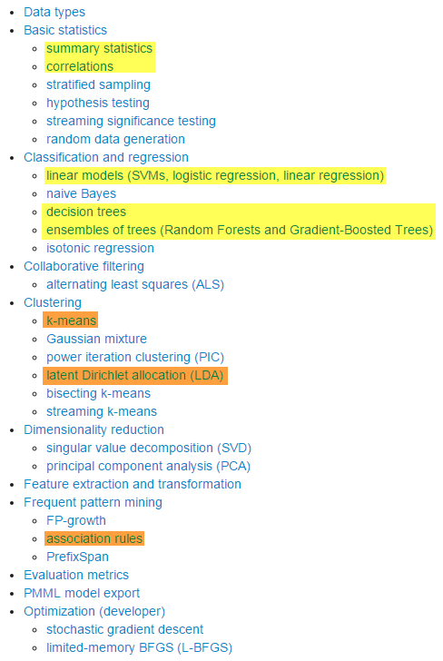

# Spark vs R
Repository for collaboration between Eastman and Virginia Tech regarding R and Spark performance

## Goal
Understand the business value of using Spark.  When does the performance benefit outweigh the setup and training costs of Spark?

## Measures
Interested in time to compute various analytics using R and Spark.  Spark's capabilities are detailed online.  The picture below highlights the methods to be measured.

## Data
Data comes from two places:
* Airline Data (http://stat-computing.org/dataexpo/2009/)
* Text Data (http://archive.ics.uci.edu/ml/datasets/Bag+of+Words)

### Data subgroups
We're interested in testing the above measures on 'small', 'medium' and 'big' data as well as 'narrow' and 'wide' data.  The definitions of these are as follows:

            Narrow   Wide
           -----------------
     Small |   1   |   4   |
    Medium |   2   |   5   |
       Big |   3   |   6   |
           -----------------

#### Airline Data

                Narrow   Wide              Narrow Columns: AirTime,ArrDelay,DepDelay,Distance,Cancelled,Diverted
              ------------------           Wide: All Columns
         2006 |   1   |   4    |
    2001-2008 |   2   |   5    |           For regression analysis use ArrDelay as response
    1987-2008 |   3   |   6    |           For classification analysis use Cancelled and CancellationCode as responses
              ------------------           Note: Not all columns are popluated for all years - we may want to drop some years
